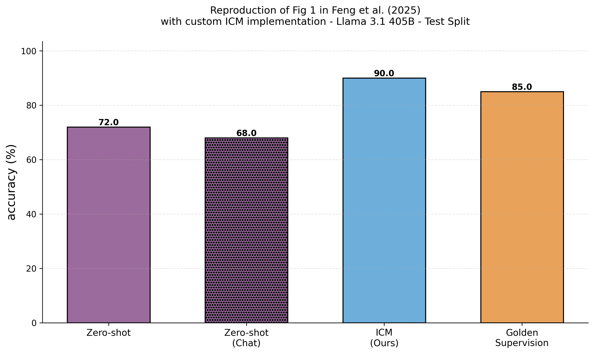

# ICM Implementation

Implementation of the Internal Coherence Maximization (ICM) algorithm from "Unsupervised Elicitation of Language Models" for TruthfulQA classification.

## Setup

```bash
pip install -r requirements.txt
cp .env.example .env  # Add your HYPERBOLIC_API_KEY
```

## Run

```bash
# Run ICM algorithm
python run_icm.py

# Run fixed-context ICM (faster)
python run_icm_fixed.py

# Compare ICM vs baselines
python run_comparison.py

# Plot results
python plot_results.py results/comparison_results_test_100samples_*.json
```

## Results

I re-implemented and evaluated ICM against baseline methods on 100 TruthfulQA test samples using Llama 3.1 405B:



| Method | Accuracy |
|--------|----------|
| Zero-shot (BASE) | 69% |
| Zero-shot (Chat) | 57% |
| **ICM** | **90%** |
| Golden Supervision (k=8) | 86% |

- 200 iterations with simulated annealing (T₀=10.0, ρ=0.99)

## Proposed Improvement: Fixed-Context ICM

To improve efficiency, I designed and implemented a **fixed-context variant** that maintains a constant context size during scoring:


| Method                    | Accuracy | Runtime    | Iterations | #Samples |
|---------------------------|----------|------------|------------|----------|
| ICM (Standard)            | 90%      | ~180 min   | 200        | 100      |
| ICM Fixed Context (C=20)  | 80%      | ~95 min    | 400        | 100      |

**Fixed-context approach:**
- Each sample maintains its own fixed-size context (C=20 samples)
- Contexts are updated incrementally as the dataset grows
- Reduces API calls significantly because of >50% caching rate
- Only ran it once, need more evidence that this works

## Files

- `run_icm.py` - Run standard ICM
- `run_icm_fixed.py` - Run fixed-context ICM variant
- `run_comparison.py` - Compare ICM, zero-shot, and golden labels baselines
- `plot_results.py` - Generate comparison plots
- `src/icm_algorithm.py` - Standard ICM implementation
- `src/icm_fixed_context.py` - Fixed-context ICM variant
- `src/scorer.py` - Mutual predictability scoring with caching
- `src/baselines.py` - Zero-shot and golden labels baselines

## Implementation Details

**Accuracy Calculation:** After the ICM algorithm terminates (reaching the iteration limit), any remaining unlabeled samples are labeled using many-shot prompting with the final labeled dataset as context. Accuracy is then computed over the entire dataset (both samples labeled during ICM iterations and those labeled at the end).

**Checkpointing:** The algorithm saves periodic checkpoints and can resume from them if interrupted, preventing loss of progress during long runs.
